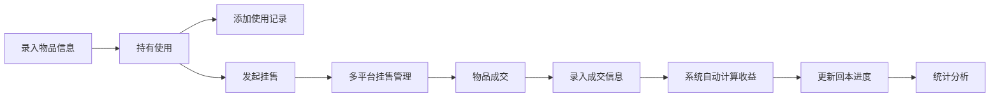

## 1. 产品概述

二手物品全生命周期管理系统，帮助用户记录从买入二手物品、日常使用、多平台挂售到最终成交的完整流程。通过首页卡片直观展示每件物品的持有天数和回本进度，让二手交易更透明、更高效。

- 主要用途：个人二手物品管理，追踪买入成本、使用时长、挂售情况和最终收益
- 解决的问题：二手物品分散管理难、回本进度不清晰、多平台挂售记录混乱
- 目标用户：经常买卖二手物品的个人用户、闲置物品较多的家庭用户
- 产品价值：帮助用户最大化二手物品价值，清晰掌握每笔交易的盈亏情况

## 2. 核心功能

### 2.1 用户角色
| 角色 | 注册方式 | 核心权限 |
|------|----------|----------|
| 普通用户 | 无需注册（本地存储） | 完整使用所有功能，管理个人物品数据 |

### 2.2 功能模块
1. **首页仪表盘**：物品卡片列表、持有天数展示、回本进度条、快速统计
2. **物品管理**：物品录入、编辑、删除、详情查看、使用记录
3. **挂售管理**：多平台挂售记录、挂售价格调整、挂售状态追踪
4. **成交管理**：成交记录录入、收益计算、买家信息记录
5. **统计分析**：整体收益统计、回本周期分析、平台成交对比

### 2.3 页面详情
| 页面名称 | 模块名称 | 功能描述 |
|----------|----------|------------|
| 首页 | 物品卡片列表 | 展示所有物品，每张卡片显示物品图片、名称、买入价、持有天数、回本进度条 |
| 首页 | 快速统计区 | 总物品数、持有中数量、已售出数量、总收益、平均回本天数 |
| 物品管理 | 物品列表 | 按状态筛选（持有中/挂售中/已成交）、搜索、排序 |
| 物品管理 | 物品表单 | 录入物品名称、类别、买入价、买入日期、图片、备注 |
| 物品管理 | 物品详情 | 完整信息展示、使用记录时间线、相关挂售/成交记录 |
| 挂售管理 | 挂售列表 | 显示所有挂售记录，按平台、状态筛选 |
| 挂售管理 | 挂售表单 | 选择物品、挂售平台（闲鱼/转转/小红书等）、挂售价格、挂售日期 |
| 成交管理 | 成交列表 | 显示所有成交记录，按时间排序 |
| 成交管理 | 成交表单 | 选择挂售记录、成交价、成交日期、买家信息、运费、备注 |
| 统计分析 | 数据概览 | 总收入、总支出、净利润、回本率、平均持有天数 |
| 统计分析 | 图表展示 | 月度收益趋势、平台成交占比、物品类别收益对比 |

## 3. 核心流程

用户买入二手物品后，在系统中录入物品信息（名称、买入价、买入日期等）。在持有期间可添加使用记录。当决定出售时，创建挂售记录，选择挂售平台并设置价格。物品成交后，录入成交信息，系统自动计算收益和回本进度。

## 4. 用户界面设计

### 4.1 设计风格
- **设计调性**：现代简约、数据可视化优先、卡片式布局
- **主色调**：深青色 #0F766E（代表稳重、财务）
- **辅助色**：琥珀色 #F59E0B（进度条、提醒）、翠绿色 #10B981（盈利、已成交）、玫红色 #EC4899（亏损）
- **中性色**：石板灰系列（背景、文字、边框）
- **按钮风格**：圆角8px，悬停有轻微上浮效果和阴影变化
- **字体**：标题使用 "Noto Sans SC" 700，正文使用 "Noto Sans SC" 400/500
- **布局风格**：顶部导航栏 + 左侧边栏 + 主内容区，卡片式布局，间距16/24px
- **图标风格**：Lucide React 线性图标，大小统一18/20px

### 4.2 页面设计概览
| 页面名称 | 模块名称 | UI元素 |
|----------|----------|--------|
| 首页 | 物品卡片 | 圆角卡片、物品图片、渐变进度条、数字动画、悬停上浮效果 |
| 首页 | 统计卡片 | 大字号数字、趋势小箭头、背景微渐变、边框高亮 |
| 物品管理 | 表单 | 分组布局、输入框聚焦动画、标签自动完成、日期选择器 |
| 物品管理 | 列表 | 斑马纹、悬停高亮、操作列固定、状态标签色彩区分 |
| 挂售管理 | 平台标签 | 各平台品牌色、图标+文字、选中态突出 |
| 统计分析 | 图表区 | 渐变色面积图、环形图、悬停数据提示、响应式缩放 |

### 4.3 响应式
- 桌面优先设计，断点：1024px（平板）、768px（手机）
- 移动端：侧边栏收起为汉堡菜单，卡片单列布局，表格转为卡片列表
- 触摸优化：按钮最小高度44px，点击反馈明显

### 4.4 交互细节
- 页面加载：元素渐入+上移动画，stagger延迟100ms
- 卡片悬停：translateY(-2px) + 阴影加深，过渡300ms
- 进度条：从0到目标值的填充动画，持续800ms
- 数字变化：滚动计数动画，持续600ms
- 表单提交：按钮loading状态，成功/失败提示toast
