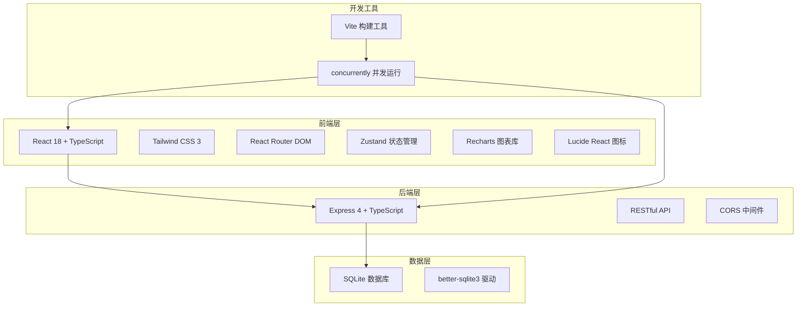
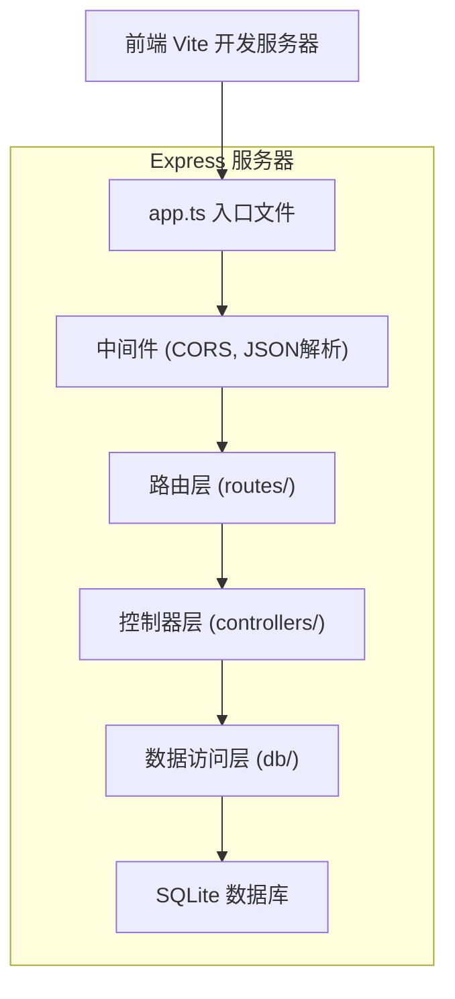
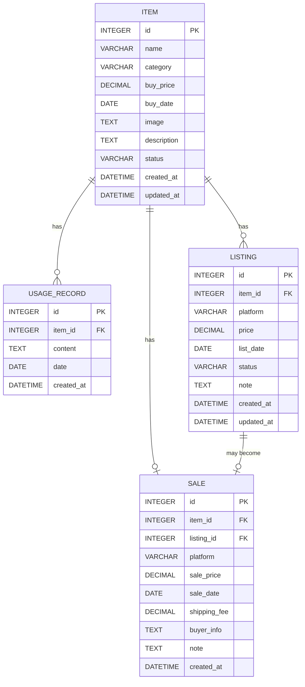

## 1. 架构设计



## 2. 技术描述

- **前端框架**：React@18 + TypeScript + Vite
- **样式方案**：Tailwind CSS@3
- **路由管理**：react-router-dom@6
- **状态管理**：zustand
- **图表组件**：recharts
- **图标库**：lucide-react
- **后端框架**：Express@4 + TypeScript
- **数据库**：SQLite (better-sqlite3)
- **构建工具**：Vite
- **并发运行**：concurrently
- **API 调用**：原生 fetch API

## 3. 路由定义

### 前端路由
| 路由路径 | 页面名称 | 说明 |
|----------|----------|------|
| / | 首页仪表盘 | 物品卡片列表、快速统计 |
| /items | 物品管理 | 物品列表、新增/编辑物品 |
| /items/:id | 物品详情 | 物品完整信息、使用记录、挂售/成交记录 |
| /listings | 挂售管理 | 挂售列表、新增挂售 |
| /sales | 成交管理 | 成交列表、新增成交 |
| /stats | 统计分析 | 数据概览、图表展示 |

### 后端 API 路由
| 路由路径 | HTTP方法 | 说明 |
|----------|----------|------|
| /api/items | GET | 获取所有物品列表 |
| /api/items | POST | 新增物品 |
| /api/items/:id | GET | 获取物品详情 |
| /api/items/:id | PUT | 更新物品信息 |
| /api/items/:id | DELETE | 删除物品 |
| /api/items/:id/usage | POST | 添加物品使用记录 |
| /api/listings | GET | 获取所有挂售记录 |
| /api/listings | POST | 新增挂售记录 |
| /api/listings/:id | PUT | 更新挂售记录 |
| /api/listings/:id | DELETE | 删除挂售记录 |
| /api/sales | GET | 获取所有成交记录 |
| /api/sales | POST | 新增成交记录 |
| /api/sales/:id | DELETE | 删除成交记录 |
| /api/stats/summary | GET | 获取统计概览数据 |
| /api/stats/monthly | GET | 获取月度收益数据 |
| /api/stats/platform | GET | 获取平台成交数据 |
| /api/stats/category | GET | 获取分类收益数据 |

## 4. API 定义

### TypeScript 类型定义

```typescript
// 物品状态
type ItemStatus = 'holding' | 'listing' | 'sold';

// 挂售平台
type Platform = 'xianyu' | 'zhuanzhuan' | 'xiaohongshu' | 'pinduoduo' | 'other';

// 挂售状态
type ListingStatus = 'active' | 'sold' | 'cancelled';

// 物品
interface Item {
  id: number;
  name: string;
  category: string;
  buyPrice: number;
  buyDate: string;
  image?: string;
  description?: string;
  status: ItemStatus;
  createdAt: string;
  updatedAt: string;
}

// 使用记录
interface UsageRecord {
  id: number;
  itemId: number;
  content: string;
  date: string;
  createdAt: string;
}

// 挂售记录
interface Listing {
  id: number;
  itemId: number;
  platform: Platform;
  price: number;
  listDate: string;
  status: ListingStatus;
  note?: string;
  createdAt: string;
  updatedAt: string;
}

// 成交记录
interface Sale {
  id: number;
  itemId: number;
  listingId?: number;
  platform: Platform;
  salePrice: number;
  saleDate: string;
  shippingFee?: number;
  buyerInfo?: string;
  note?: string;
  createdAt: string;
}

// 统计数据
interface StatsSummary {
  totalItems: number;
  holdingItems: number;
  soldItems: number;
  totalIncome: number;
  totalExpense: number;
  netProfit: number;
  returnRate: number;
  avgHoldingDays: number;
}

interface MonthlyData {
  month: string;
  income: number;
  expense: number;
  profit: number;
}

interface PlatformData {
  platform: Platform;
  count: number;
  amount: number;
}

interface CategoryData {
  category: string;
  count: number;
  profit: number;
}
```

### 请求/响应示例

**GET /api/items**
响应：
```json
{
  "code": 0,
  "message": "success",
  "data": [
    {
      "id": 1,
      "name": "索尼A7M4相机",
      "category": "数码产品",
      "buyPrice": 15800,
      "buyDate": "2024-03-15",
      "status": "holding",
      "createdAt": "2024-03-15T10:00:00Z",
      "updatedAt": "2024-03-15T10:00:00Z"
    }
  ]
}
```

**POST /api/items**
请求体：
```json
{
  "name": "索尼A7M4相机",
  "category": "数码产品",
  "buyPrice": 15800,
  "buyDate": "2024-03-15",
  "description": "95新，快门次数5000"
}
```

## 5. 服务器架构图



### 目录结构
```
api/
  ├── src/
  │   ├── app.ts              # Express 应用入口
  │   ├── routes/             # 路由定义
  │   │   ├── items.ts
  │   │   ├── listings.ts
  │   │   ├── sales.ts
  │   │   └── stats.ts
  │   ├── controllers/        # 业务逻辑
  │   │   ├── items.ts
  │   │   ├── listings.ts
  │   │   ├── sales.ts
  │   │   └── stats.ts
  │   └── db/                 # 数据库访问
  │       ├── index.ts        # 数据库连接
  │       ├── schema.ts       # 表结构定义
  │       └── seed.ts         # 初始数据
  └── tsconfig.json

src/                          # 前端源码
  ├── components/             # 公共组件
  │   ├── Layout/
  │   ├── ItemCard/
  │   ├── StatCard/
  │   ├── Modal/
  │   └── ...
  ├── pages/                  # 页面组件
  │   ├── Dashboard/
  │   ├── Items/
  │   ├── ItemDetail/
  │   ├── Listings/
  │   ├── Sales/
  │   └── Stats/
  ├── store/                  # Zustand 状态管理
  │   └── useStore.ts
  ├── utils/                  # 工具函数
  │   ├── api.ts
  │   ├── format.ts
  │   └── constants.ts
  ├── types/                  # TypeScript 类型
  │   └── index.ts
  ├── App.tsx
  ├── main.tsx
  └── index.css

shared/                       # 前后端共享类型
  └── types.ts
```

## 6. 数据模型

### 6.1 数据模型定义



### 6.2 数据定义语言

```sql
-- 物品表
CREATE TABLE IF NOT EXISTS items (
  id INTEGER PRIMARY KEY AUTOINCREMENT,
  name VARCHAR(255) NOT NULL,
  category VARCHAR(100) NOT NULL,
  buy_price DECIMAL(10,2) NOT NULL,
  buy_date DATE NOT NULL,
  image TEXT,
  description TEXT,
  status VARCHAR(20) NOT NULL DEFAULT 'holding',
  created_at DATETIME DEFAULT CURRENT_TIMESTAMP,
  updated_at DATETIME DEFAULT CURRENT_TIMESTAMP
);

-- 使用记录表
CREATE TABLE IF NOT EXISTS usage_records (
  id INTEGER PRIMARY KEY AUTOINCREMENT,
  item_id INTEGER NOT NULL,
  content TEXT NOT NULL,
  date DATE NOT NULL,
  created_at DATETIME DEFAULT CURRENT_TIMESTAMP,
  FOREIGN KEY (item_id) REFERENCES items(id) ON DELETE CASCADE
);

-- 挂售记录表
CREATE TABLE IF NOT EXISTS listings (
  id INTEGER PRIMARY KEY AUTOINCREMENT,
  item_id INTEGER NOT NULL,
  platform VARCHAR(50) NOT NULL,
  price DECIMAL(10,2) NOT NULL,
  list_date DATE NOT NULL,
  status VARCHAR(20) NOT NULL DEFAULT 'active',
  note TEXT,
  created_at DATETIME DEFAULT CURRENT_TIMESTAMP,
  updated_at DATETIME DEFAULT CURRENT_TIMESTAMP,
  FOREIGN KEY (item_id) REFERENCES items(id) ON DELETE CASCADE
);

-- 成交记录表
CREATE TABLE IF NOT EXISTS sales (
  id INTEGER PRIMARY KEY AUTOINCREMENT,
  item_id INTEGER NOT NULL,
  listing_id INTEGER,
  platform VARCHAR(50) NOT NULL,
  sale_price DECIMAL(10,2) NOT NULL,
  sale_date DATE NOT NULL,
  shipping_fee DECIMAL(10,2) DEFAULT 0,
  buyer_info TEXT,
  note TEXT,
  created_at DATETIME DEFAULT CURRENT_TIMESTAMP,
  FOREIGN KEY (item_id) REFERENCES items(id) ON DELETE CASCADE,
  FOREIGN KEY (listing_id) REFERENCES listings(id) ON DELETE SET NULL
);

-- 索引
CREATE INDEX IF NOT EXISTS idx_items_status ON items(status);
CREATE INDEX IF NOT EXISTS idx_items_category ON items(category);
CREATE INDEX IF NOT EXISTS idx_listings_platform ON listings(platform);
CREATE INDEX IF NOT EXISTS idx_listings_status ON listings(status);
CREATE INDEX IF NOT EXISTS idx_sales_platform ON sales(platform);
CREATE INDEX IF NOT EXISTS idx_sales_date ON sales(sale_date);
```

### 6.3 初始种子数据

```sql
-- 插入示例物品
INSERT INTO items (name, category, buy_price, buy_date, description, status) VALUES
('索尼A7M4相机', '数码产品', 15800, '2024-03-15', '95新，快门次数5000，配24-70镜头', 'holding'),
('MacBook Pro 14寸', '数码产品', 12999, '2024-01-20', 'M3芯片，16G+512G，带AppleCare', 'listing'),
('任天堂Switch OLED', '游戏设备', 2199, '2023-11-10', '港版，白色，送3个游戏', 'sold'),
('宜家双人沙发', '家居家具', 899, '2023-08-05', '深灰色布艺沙发，9成新', 'holding'),
('戴森V10吸尘器', '家用电器', 3290, '2023-06-18', '国行正品，配件齐全', 'listing');

-- 插入使用记录
INSERT INTO usage_records (item_id, content, date) VALUES
(1, '出门旅行拍摄风景', '2024-04-10'),
(1, '拍摄产品照片', '2024-05-05'),
(4, '朋友来访使用', '2023-10-01');

-- 插入挂售记录
INSERT INTO listings (item_id, platform, price, list_date, status, note) VALUES
(2, 'xianyu', 10500, '2024-05-20', 'active', '不议价，顺丰包邮'),
(5, 'xianyu', 2000, '2024-06-01', 'active', '自提优先'),
(5, 'zhuanzhuan', 2100, '2024-06-01', 'active', '平台验机');

-- 插入成交记录
INSERT INTO sales (item_id, listing_id, platform, sale_price, sale_date, shipping_fee, buyer_info, note) VALUES
(3, NULL, 'xiaohongshu', 1800, '2024-04-15', 25, '北京买家张先生', '面交，很爽快');
```
